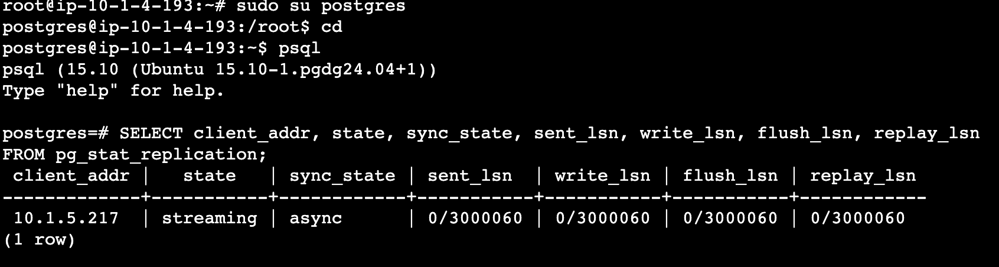
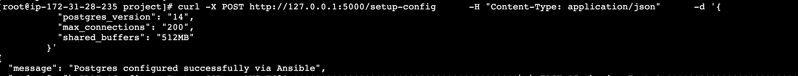

# **PostgreSQL Primary-Read-Replica Automation API**

## Overview

This project provides an API that automates the setup of a PostgreSQL primary-read-replica architecture using Terraform and Ansible. The API allows users to configure key parameters such as PostgreSQL version, instance type, and number of replicas. It dynamically generates and applies Terraform configurations to provision AWS infrastructure and executes Ansible playbooks to install and configure PostgreSQL, ensuring seamless replication between the primary and replicas.

## Features

- **Infrastructure as Code (IaC)**: Utilizes **Terraform modules** for flexible, reusable, and maintainable infrastructure provisioning.

- **Configuration Management**: Uses **Ansible** to automate the setup and configuration of **PostgreSQL with replication**.

- **Security Best Practices**: Enhances security by using **AWS Session Manager** instead of SSH for Ansible execution. The PostgreSQL cluster is deployed in a **private subnet** for better security.

- **Modular and Scalable**: Supports **dynamic configurations** for PostgreSQL settings (e.g., `max_connections`, `shared_buffers`), making it adaptable to different environments.

- **End-to-End Automation**: Provides **API endpoints** to generate Terraform and Ansible configurations, apply infrastructure changes, and automate the PostgreSQL setup.


## Terraform Directory Structure

```bash

├── backend
│   ├── backend.tfvars
│   ├── s3_backend.tf
│   ├── terraform.tfstate
│   ├── terraform.tfstate.backup
│   └── variables.tf
├── backend.tf
├── iam.tf
├── main.tf
├── module
│   └── vpc
│       ├── main.tf
│       ├── outputs.tf
│       └── variables.tf
├── provider.tf
├── terraform.tfvars
├── variables.tf
└── versions.tf

```

###  **Short Explanation for Each Folder**  

```md
## Folder & File Overview

- **backend/** - Stores Terraform state configuration (S3 backend & DynamoDB for state locking).
- **modules/vpc/** - Reusable VPC module for defining networking resources.
- **iam.tf** - Defines IAM roles and permissions.
- **main.tf** - The main Terraform configuration file.
- **provider.tf** - Configures the cloud provider (AWS, GCP, etc.).
- **terraform.tfvars** - Stores variable values.
- **versions.tf** - Specifies required Terraform and provider versions.
```

# Ansible Configuration for PostgreSQL Setup  

This Ansible setup automates the installation and configuration of **PostgreSQL with replication** using a structured and modular approach. It follows best practices by organizing tasks into **roles** to ensure reusability and maintainability.

## Directory Structure  

```bash
├── ansible.cfg                # Ansible configuration file
├── inventory/
│   └── aws_ec2.yml            # Dynamic inventory configuration for AWS EC2
├── playbooks/
│   ├── playbook.yaml          # Main playbook for PostgreSQL setup
│   └── test-ssm.yml           # Playbook for testing AWS Session Manager connection
└── roles/
    └── postgress/
        ├── handlers/
        │   └── main.yaml      # Defines handlers for service restarts
        ├── tasks/
        │   ├── core_config.yml    # Common PostgreSQL configurations
        │   ├── install.yml        # PostgreSQL installation steps
        │   ├── main.yml           # Entry point for task execution
        │   ├── master_config.yml  # Configuration for PostgreSQL master node
        │   └── worker_config.yml  # Configuration for PostgreSQL replica node
        ├── templates/
        │   └── postgresql.conf.j2 # Template for PostgreSQL configuration file
        └── vars/
            └── main.yml           # Variable definitions for PostgreSQL setup
```

## Features  

- **Role-Based Structure** – Separates concerns using Ansible **roles** for better maintainability.  
- **Dynamic Inventory** – Uses **AWS EC2 dynamic inventory** for automatic instance discovery.  
- **Automated PostgreSQL Replication** – Configures **master** and **replica** nodes with predefined roles.  
- **Secure Execution** – Runs through **AWS Session Manager** instead of direct SSH access, enhancing security.  
- **Template-Based Configuration** – Uses **Jinja2 templates** to dynamically generate `postgresql.conf`.  

# 🛠️ How to Run

This guide provides step-by-step instructions to set up and execute Terraform and Ansible automation using Flask APIs.

## 1️⃣ Clone the Repository
Clone the project repository from GitHub and navigate into the project directory.
```sh
git clone https://github.com/gauravrattan/project.git
cd project
```

## 2️⃣ Install Dependencies
Install the required dependencies, including Flask.
```sh
pip install Flask
```

## 3️⃣ Start the API Server
Run the Flask application to enable API-based automation.
```sh
python app.py
```

---

## ⚡ Backend Initialization

### 4️⃣ Initialize the Terraform Backend
Before applying Terraform configurations, initialize the **S3 backend with DynamoDB** for state management.
```sh
curl -X POST http://127.0.0.1:5000/setup-backend
```

---

## 🌍 Terraform Operations

### 5️⃣ Initialize Terraform
Initialize the Terraform working directory, download providers, and set up modules.
```sh
curl -X POST http://127.0.0.1:5000/terraform-init
```

### 6️⃣ Generate Terraform Plan
Generate and display an execution plan before applying changes.
```sh
curl -X POST http://127.0.0.1:5000/terraform-plan
```

### 7️⃣ Apply Terraform Configuration
Apply the Terraform configurations to provision the required AWS resources.
```sh
curl -X POST http://127.0.0.1:5000/terraform-apply
```

---

## 🔄 Updating Terraform Variables

### 8️⃣ Update Instance Type & Replicas
Dynamically update Terraform variables such as **PostgreSQL replicas** and **EC2 instance type**.
```sh
curl -X POST http://127.0.0.1:5000/update-tfvars \  
-H "Content-Type: application/json" \  
-d '{
  "postgres_worker_replicas": 5,
  "instance_type": "t3.large"
}'
```

---

## 🔧 Configure PostgreSQL Settings (Ansible API)

### 9️⃣ Setup PostgreSQL Configuration
Configure PostgreSQL settings dynamically using the Ansible API.
```sh
curl -X POST http://127.0.0.1:5000/setup-config \  
     -H "Content-Type: application/json" \  
     -d '{
           "postgres_version": "15",
           "max_connections": "200",
           "shared_buffers": "512MB"
         }'
```

---

## ✅ Verification
- Verify resources on **AWS Console**.
- Check the Terraform state file (`terraform.tfstate`) to confirm applied infrastructure changes.
- Ensure the **PostgreSQL cluster is running** with correct master and replica configurations.
- Use **Ansible playbooks** if further configuration is required.

---

## 🎯 Summary of API Endpoints

| Action                     | Command |
|----------------------------|---------|
| **Initialize Backend**      | `curl -X POST http://127.0.0.1:5000/setup-backend` |
| **Terraform Init**         | `curl -X POST http://127.0.0.1:5000/terraform-init` |
| **Terraform Plan**         | `curl -X POST http://127.0.0.1:5000/terraform-plan` |
| **Terraform Apply**        | `curl -X POST http://127.0.0.1:5000/terraform-apply` |
| **Update Instance Type & Replicas** | `curl -X POST http://127.0.0.1:5000/update-tfvars -H "Content-Type: application/json" -d '{ "postgres_worker_replicas": 5, "instance_type": "t3.large" }'` |
| **Setup PostgreSQL Configuration** | `curl -X POST http://127.0.0.1:5000/setup-config -H "Content-Type: application/json" -d '{ "postgres_version": "15", "max_connections": "200", "shared_buffers": "512MB" }'` |

---
## 1. PostgreSQL Replication Setup
This image shows the successful setup of PostgreSQL replication.



## 2. Ansible API Execution
This image displays a successful API hit for Ansible automation.

## 🌟 Future Scope

#### Use AWS Secrets Manager or Vault for secure password management.

#### Implement Patroni for high availability in PostgreSQL clusters.

#### Enhance Logging by adding detailed logs for better debugging and monitoring.

## Assumptions
Basic knowledge of **AWS**, **Ansible**, **Terraform**, and **Python** is required.


